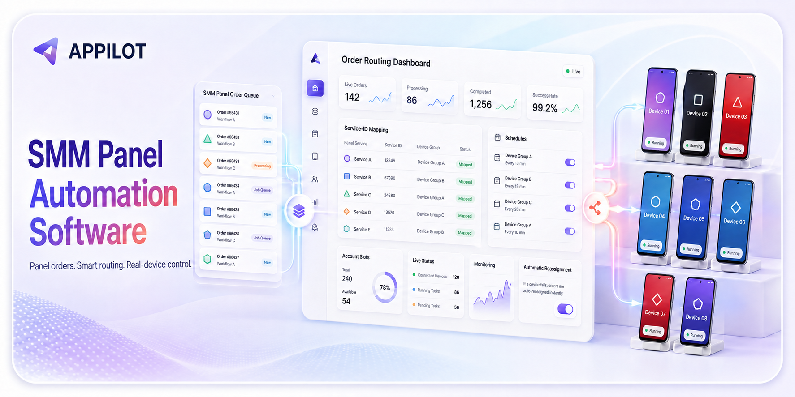
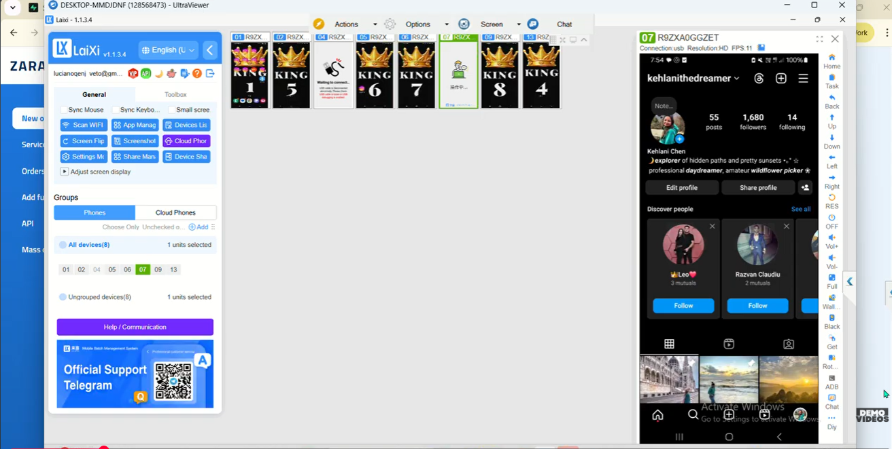
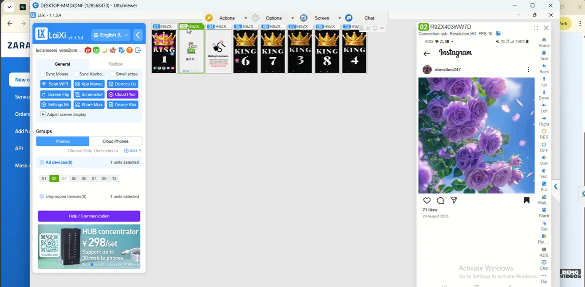
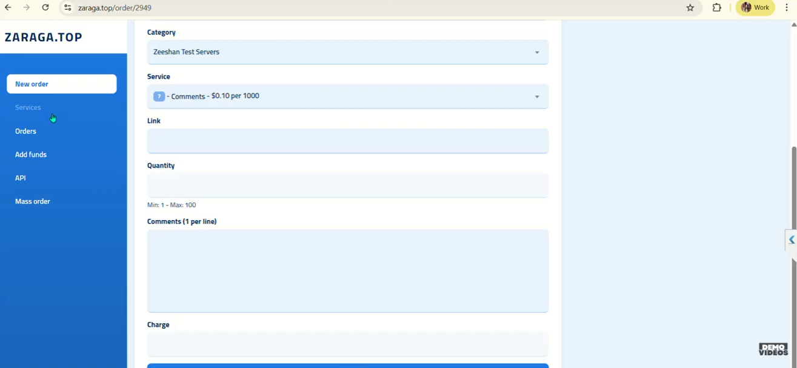
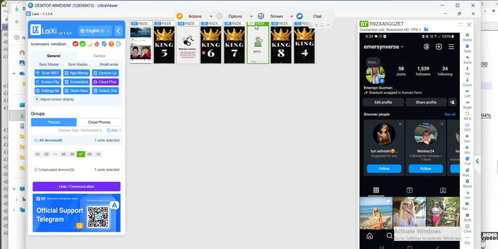

# SMM Panel Automation Software

Appilot's **SMM Panel Automation Software** is a custom operations layer for connecting supported panel APIs with order queues, service mappings, account slots, schedules, authorized Android devices, monitoring, and recovery workflows.

> Built for teams that need a controlled system around their existing panel and device operations—not another disconnected dashboard.

[View the product](https://www.appilot.app/bot/smm-panel-automation-software-routing) · [Watch the demo](https://youtu.be/HuLvXaRWLyM) · [Explore SMM services](https://www.appilot.app/services/social-media-automation-bots/smm-services)

## What the system coordinates

- Supported SMM panel API connections and scheduled order ingestion
- Service-ID-to-workflow mapping
- Local order queues and processing states
- Authorized profile slots with schedules and configurable limits
- Real Android-device availability and assignment
- Eligibility-based order routing and workload distribution
- Failure logging, operator alerts, and permitted reassignment
- One operational view for queues, slots, devices, and history

## Workflow

1. A supported panel API provides a new order.
2. The system validates and stores the order in a local queue.
3. The service ID selects the configured workflow and eligibility rules.
4. Routing chooses an available authorized slot within its schedule and limits.
5. The dashboard records progress, exceptions, and operator actions.
6. Permitted status information is synchronized with the connected panel.

## Product views

### Multi-device operations

Central visibility across connected devices and authorized account slots.

### Scheduled account workflow

Each slot can carry its own operating window, limits, availability state, and workflow assignment.

### Panel order configuration

Panel-side services and order inputs can be mapped to controlled internal workflows.

### Device fleet visibility

Operators can inspect device state and intervene when a task or device needs attention.

## Designed for operational control

Appilot adapts the system to the customer's supported panel API, service catalog, account model, schedules, routing rules, notification channels, reporting needs, and deployment environment. Human review, conservative limits, clear permissions, and platform-compliant operation should remain part of every rollout.

## Learn more

- [SMM Panel Automation Software](https://www.appilot.app/bot/smm-panel-automation-software-routing)
- [SMM services and custom API integration](https://www.appilot.app/services/social-media-automation-bots/smm-services)
- [How to manage multiple social media accounts](https://www.appilot.app/blog/manage-multiple-social-media-accounts)
- [How to build a brand on social media](https://www.appilot.app/blog/build-brand-social-media-step-by-step)
- [Appilot vs SMMFollows](https://medium.com/@awais.shahid_58609/appilot-vs-smmfollows-custom-smm-panel-automation-a8ffe195398b)
- [Instagram marketing strategy for multiple accounts](https://medium.com/@awais.shahid_58609/how-to-build-an-instagram-marketing-strategy-for-multiple-accounts-ba87b24d89db)
- [SMM panel automation review](https://medium.com/@70142466/smm-panel-automation-review-my-workflow-test-3fa5d3da3a14)
- [Product demo](https://youtu.be/HuLvXaRWLyM)

## Build your custom workflow

Need panel integration, order routing, slot scheduling, device monitoring, or a unified operator dashboard?

**[Talk to Appilot about your SMM automation system](https://www.appilot.app/services/social-media-automation-bots/smm-services)**

